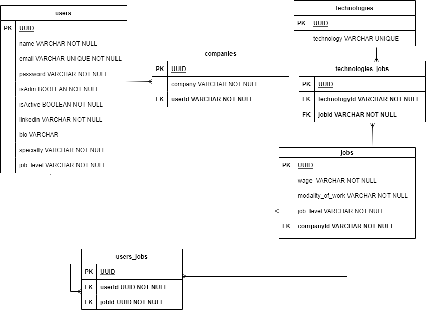

# Visão Geral

Essa API foi desenvolvida com base em nosso Projeto Front-End Kenzinho Vagas que foi pensado para criar uma plataforma que unisse empresas e desenvolvedores, com nosso aprendizado no M4 desenvolvemos essa API para integrar nossa aplicação futuramente.

# Documentação da API

Para documentação completa acesse: https://kenzinho-vagas-api.onrender.com/

## Tabela de Conteúdos

- [Visão Geral](#1-visão-geral)
- [Diagrama ER](#2-diagrama-er)
- [Instalando Dependências](#3-instalando-dependências)
	- [Comandos](#31-instalando-dependências)
- [Variáveis de Ambiente](#4-variáveis-de-ambiente)
- [Migrations](#5-migrations)
- [Autenticação](#6-autenticação)
- [Endpoints](#7-endpoints)

---

## 1. Visão Geral

Visão geral do projeto, um pouco das tecnologias usadas.

- [NodeJS](https://nodejs.org/en/)
- [Express](https://expressjs.com/pt-br/)
- [TypeScript](https://www.typescriptlang.org/)
- [PostgreSQL](https://www.postgresql.org/)
- [TypeORM](https://typeorm.io/)
- [Yup](https://www.npmjs.com/package/yup)

A URL base da aplicação:
https://kenzinho-vagas-api.onrender.com/

---

## 2. Diagrama ER
[ Voltar para o topo ](#tabela-de-conteúdos)


Diagrama ER da API definindo bem as relações entre as tabelas do banco de dados.




### 3 - Comandos

 - Instalando Dependências

Clone o projeto em sua máquina e instale as dependências com o comando:

```shell
yarn install
```

- Para rodar a aplicação use o comando:

```shell
yarn dev
```

- Para rodar testes use o comando:

```shell
yarn test
```

## 4 - Variáveis de Ambiente

Em seguida, crie um arquivo **.env**, copiando o formato do arquivo **.env.example**:
```
cp .env.example .env
```

Configure suas variáveis de ambiente com suas credenciais do Postgres e uma nova database da sua escolha.

## 5 - Migrations

Execute as migrations com o comando:

```
yarn typeorm migration:run -d src/data-source.ts
```

---

## 6 - Endpoints

- [/users]
    - [POST   - /users](Criação de usuários)
    - [GET    - /users](Listar usuários)
	- [GET    - /users/:id](Listar perfil)
	- [PATH   - /users/:id](Atualizar perfil)
	- [DELETE - /users/:id](Deletar usuário)
- [/jobs]
	- [POST   - /jobs](Criação de vagas)
    - [GET    - /jobs](Listar vagas)
	- [GET    - /jobs/companies/:id](Listar vagas por companhia)
	- [GET    - /jobs/technologies/:id](Listar vagas por tecnologia)
	- [GET    - /jobs/:id/user](Listar usuários de uma vaga)
	- [PATH   - /jobs/:id](Atualizar vaga)
	- [DELETE - /jobs/:id](Deletar vaga)
- [/companies]
	- [POST   - /companies](Criação de companhia)
    - [GET    - /companies](Listar companhias)
	- [PATH   - /companies/:id](Atualizar companhia)
	- [DELETE - /companies/:id](Deletar companhias)
- [/techs]
	- [GET    - /techs](Listar tecnologias)
- [/jobUser]
	- [POST   - /jobUser](Salvar vagas)
    - [GET    - /jobUser](Listar vagas salvas)
	- [DELETE - /jobUser/:id](Deletar vagas salvas)
- [/session]
	- [POST   - /session](Fazer login)
---
##  **Users**

O objeto User é definido como:

| Campo      | Tipo   | Descrição                                     		|
| -----------|--------|-----------------------------------------------------|
| id         | string | Identificador único do usuário                  	|
| name       | string | O nome do usuário.                              	|
| email      | string | O e-mail do usuário.                            	|
| password   | string | A senha de acesso do usuário                    	|
| isAdm      | boolean| Define se um usuário é Administrador ou não.    	|
| isActive   | boolean| Define se o usuário está ativo ou se foi deletado.	|
| linkedin   | string | Define o linkedin do usuário.    					|
| bio	     | string | A bio do usuário                    				|
| specialty  | string | Define se um usuário Back, Front ou FullStack.  	|
| jobLevel   | string | Define se o usuário é Júnior, Pleno ou Sênior   	|

### Possíveis Erros:
| Status | Descrição 	|
|--------|--------------|
|   409  | Conflict 	|
|   401  | Unauthorized |
|   404  | Not found 	|
|   403  | Forbidden 	|

---


